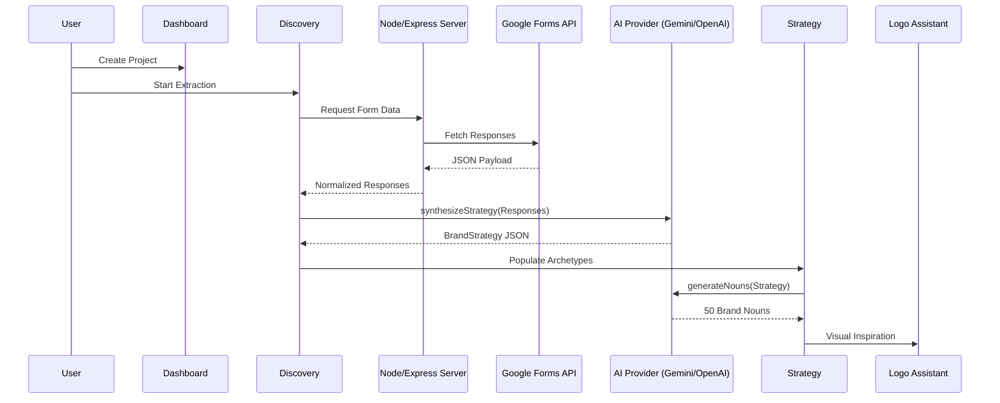

# Framework Reference: BrandForge Technical Architecture

This document provides the authoritative technical reference for the BrandForge Branding Suite. It details the **Sequential Intelligence Pipeline (S.I.P)**, service orchestration logic, and data schema requirements.

---

## 🔄 System Workflow: S.I.P Engine

The **Sequential Intelligence Pipeline (S.I.P)** is a deterministic data-flow architecture that ensures brand identity assets are derived from discovery data.

### Sequence Flow

---

## 🏗️ The Platform Core: Interface vs. Intelligence
BrandForge is architected on a dual-layer module model that ensures strategic fidelity is preserved across all visual transitions.

- **The Interface (UI)**: Technically constrained by the **Zero-Scroll Standard**, the UI layer focus is on "Eliminating Friction." It uses grid-based density to provide the user with maximum strategic visibility.
- **The Intelligence (Logic)**: Operated by the **S.I.P (Sequential Intelligence Pipeline)**, this layer focuses on "Strategic Inheritance." Data from each station flow-controls the parameters of the next (e.g., Discovery data weights the Archetype synthesis).

---

## 🧬 S.I.P: The Sequential Intelligence Pipeline
The S.I.P is the technical backbone of BrandForge, ensuring a state-aware workflow.

1. **Extraction (Discovery)**: Captures raw DNA strings and user intent (100% manual or GForms sync).
2. **Synthesis (Strategy)**: Processes DNA through the archetypal mapping logic and market SWOT profiles.
3. **Alchemy (Logo)**: Translates strategy into visual Pd (Propositional Density) metadata and noun toolkits.
4. **Forging (System)**: Converts Pd data into deterministic, WCAG-compliant design tokens.

---

## 🧠 Service Orchestration (Intelligence Layer)

BrandForge core logic is decoupled into specialized services, ensuring localized fault tolerance and strategic fidelity.

### 1. `brandService` (The Orchestrator)
**Namespace**: `src/services/brandService.ts`

| Function | Responsibility |
| :--- | :--- |
| `normalizeBrandStrategy` | Intercepts AI-generated JSON and executes "Data Healing" on malformed archetype objects. |
| `generateNouns` | Synthesizes 50 visual-naming constructs using the S.I.P metadata. |
| `generateConceptSmushes` | Executes visual-strategic pairings to create logo mark inspirations. |

**The "Data Healer" Middleware**
The `normalizeBrandStrategy` function serves as a critical normalization layer. It validates AI outputs against the Jungian Archetype model, filling missing psychological fields (Goal, Fear, Talent) using deterministic reference anchors.

### 2. `aiProvider` (Multi-Model Adapter)
**Namespace**: `src/services/aiProvider.ts`

- **Adapter Model**: Implements a unified interface for Gemini (Google) and OpenAI.
- **Error Propagation**: Handles API rate limits and connection retries via a proactive state-testing mechanism.

### 3. `fallbackStrategyEngine` (Offline Logic)
**Namespace**: `src/services/fallbackStrategyEngine.ts`

- **Deterministic Mapping**: Generates "Base Strategies" derived from industry and stage metadata. 
- **Usage**: Automatically engaged when AI connectivity is interrupted to maintain platform availability.

---

## 📐 Data Schemas (The S.I.P Model)

The following interfaces in `src/types.ts` represent the absolute data requirements for the branding engine.

### `BrandDiscovery`
The structural ingestion blueprint for client DNA.

| Field | Type | Description |
| :--- | :--- | :--- |
| `registeredName` | `string` | The legal entity name. |
| `industry` | `string` | Primary vertical (mapped to S.I.P logic). |
| `customerEmotionalOutcome` | `string[]` | List of targeted psychological outcomes. |

### `BrandStrategy`
The synthesized high-fidelity strategic asset.

| Section | Content | Requirement |
| :--- | :--- | :--- |
| **Foundation** | Mission/Vision/Philosophy | 100% S.I.P Alignment |
| **Personality** | Jungian Archetype Profiles | Tiered (Primary/Sec/Tert) |
| **Messaging** | Archetype-based Tone Cases | 5 Usage Territories |

---

## 🖥️ Infrastructure & Persistence

### Server Anatomy (`server.ts`)
The Node.js Express layer manages the "Global Handshake."
- **Authentication**: Executes OAuth2 protocols for third-party ingestion (Google Workspace).
- **Industry Mapping**: Normalizes raw question IDs into semantic keys for the `brandService`.

### Persistence Layer (`localDb.ts`)
- **Storage Model**: `localStorage` JSON serialization.
- **Portability Protocol**: Enables full-library exports and atomic project snapshots for environment migration.

---

## 🎨 Professional UX Constraints

| Standard | Implementation | Goal |
| :--- | :--- | :--- |
| **Zero-Scroll** | `h-[75vh]` & Viewport-Relative UI | Focus-lock. |
| **Blueprint UI** | Zinc-950 Surface / Zinc-800 Borders | Technical Density. |
| **Global Frame** | Pin-edge Sidebar & Persistent Notification Popovers | Spatial Integrity. |

---

*Copyright © 2026 TANATEQ INNOVATIONS LTD. All Rights Reserved.*
