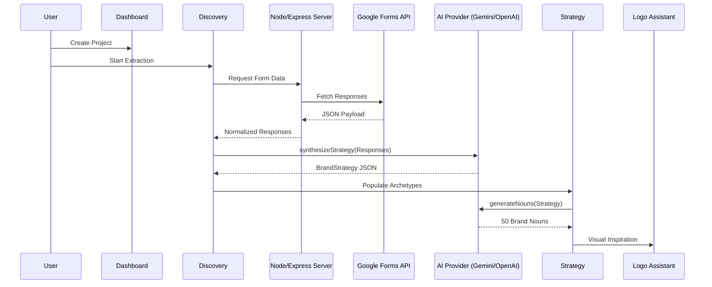

# Technical Architecture: The BrandForge Standard

BrandForge is built on the **"Modern Blueprint"** design philosophy—a high-density, professional aesthetic optimized for a 1:1 **"Commander Console"** experience. This document provides the authoritative technical breakdown of the platform's anatomy.

---

## 🔄 Sequential Intelligence Pipeline (S.I.P)

BrandForge uses a strict one-way data flow to ensure that brand identity is anchored in discovery data.

## 📂 Directory Anatomy
A map for developers navigating the BrandForge workspace:

- **`src/`**: The core application root.
    - **`components/`**: Atomic and complex UI elements (Dashboard, Discovery, Settings).
    - **`services/`**: The Intelligence Layer (AI providers, strategy orchestration, PDF generation).
    - **`utils/`**: Deterministic logic (mapping, cleanup, data portability).
    - **`types.ts`**: The central source of truth for all data interfaces.
    - **`localDb.ts`**: The persistence abstraction layer.
    - **`AuthContext.tsx`**: Identity and session management.
- **`docs/`**: Technical and strategic documentation hub.
- **`dist/`**: Production build output.

---

## 🧠 The Intelligence Layer (Services)

BrandForge logic is distributed across four specialized services that ensure 100% strategic fidelity.

### 1. `brandService.ts` (The Orchestrator)
The central hub for the **Sequential Intelligence Pipeline (S.I.P)**. 
- **Responsibilities**: Converting discovery data into strategy, managing state-inheritance, and triggering the "Data Healer" to repair fragmented AI outputs.
- **The "Data Healer" (Normalization Layer)**: Located in `brandService.ts`, this layer intercepts AI-generated JSON to:
    -   Repair missing Jungian fields (Goal, Fear, Talent) using reference anchors.
    -   Normalize `inPractice` arrays to prevent rendering crashes.
    -   Sanitize string formatting (fixing encoded newlines in messaging templates).
- **Standards**: All strategic outputs must satisfy the Jungian Archetype validation model.

### 2. `aiProvider.ts` (The Multi-Model Adapter)
A unified interface for LLM interaction.
- **Supported Models**: 
    - **Gemini (Nano Banana)**: Used for core strategy synthesis and noun toolkit generation.
    - **OpenAI (DALL-E 3)**: Targeted for visual concept inspiration.
- **Governance**: Implements proactive key testing and error propagation.

### 3. `fallbackStrategyEngine.ts` (The Safety Net)
Ensures the platform remains functional during offline states or API failures.
- **Logic**: Uses a deterministic mapping engine to generate "Base Strategies" derived from industry and stage metadata without requiring a live AI call.

### 4. `pdfService.ts` (The Snapshot Engine)
Generates high-fidelity project handoffs.
- **Tech Stack**: `jsPDF` + `html2canvas`.
- **Logic**: Uses a 1:1 UI snapshot model to ensure that the Positioning Maps and Archetype Wheels in the PDF are identical to the screen interface.

---

## 🖥️ Server Anatomy (`server.ts`)

The Node.js Express layer serves as the "Bridge" between the Vite frontend and third-party data ecosystems.

### Core Responsibilities
-   **OAuth2 Protocol**: Manages Google Identity tokens for secure Drive and Forms access.
-   **Industry Mapping**: Translates raw form question IDs into semantic keys used by the Branding Engine.
-   **Static Orchestration**: Serves the optimized production build (`/dist`) and handles SPA routing fallbacks.

---

## 💾 The Memory Layer (Persistence & State)

### 1. `localDb.ts` & `localStorage`
- **Philosophy**: Local-first development. All projects are stored as JSON blobs in `localStorage`.
- **Portability**: Includes logic for atomic imports and exports of the entire project library.

### 2. `AuthContext.tsx`
- **Philosophy**: State-aware identity.
- **Logic**: Manages the user profile (Role, Avatar, Agency Details) and serves as the gatekeeper for Firebase Firestore synchronization.

---

## 📐 Data Schema (The S.I.P Model)

The platform is anchored by two primary interfaces in `types.ts`:

### 1. `BrandDiscovery`
The 9-phase intake blueprint. Captures client DNA, industry markers, and psychological "feels."

### 2. `BrandStrategy`
The absolute strategic asset. Includes:
- **Overview**: 4-Point Strategic Definition (Who, What, How, Where).
- **Foundation**: Mission, Vision, and Philosophy.
- **Audience**: Maslow-level needs mapping and narrative groups.
- **Personality**: Jungian Archetype primary/secondary profiles and Pd (Propositional Density) scores.

---

## 🎨 Spatial Optimization (Zero-Scroll Standard)
Technically enforced across the entire platform:
- **Viewport-Relative Containers**: Components use `h-[75vh]` or `max-h-screen` constraints.
- **Internal Overflow Management**: High-density lists (e.g., Notification Audit Center) use hidden custom scrollbars to maintain visual integrity.
- **Global Frame Integrity**: The Sidebar (`w-20` on desktop) and Notification popover are pinned to the edge of the viewport to ensure they never scroll with page content.

---

## 🎨 Design System Reference (Tokens)

| Token | Category | Value / Hex | Usage |
| :--- | :--- | :--- | :--- |
| **Surface** | Background | `#09090b` (Zinc-950) | Main App Background |
| **Blueprint** | Border | `#27272a` (Zinc-800) | Structural Dividers |
| **Accent** | Brand | `#3f3f46` (Zinc-700) | Hover States / Primary Buttons |
| **Typography** | Primary | `#fafafa` (Zinc-50) | Headers / High Importance |
| **Typography** | Muted | `#a1a1aa` (Zinc-400) | Metadata / Labels |

---

*Copyright © 2026 TANATEQ INNOVATIONS LTD. All Rights Reserved.*
