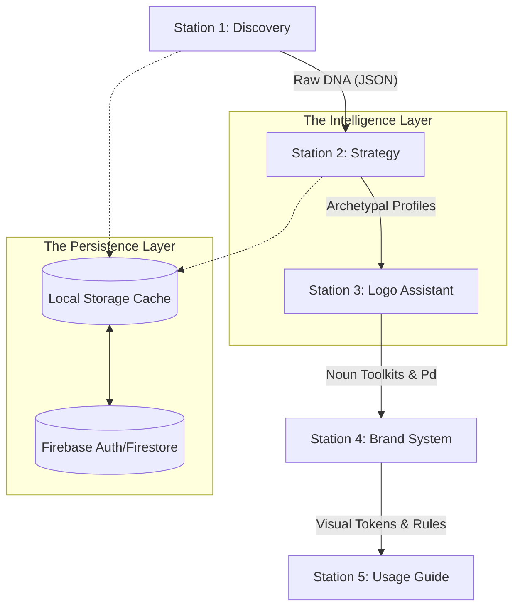

# Framework Reference: BrandForge Technical Architecture

[← Back to Index](../README.md) | [Operator Manual](operations.md) | [User Guide](user_guide.md)

This document provides the authoritative technical reference for the BrandForge Branding Suite. It details the **Sequential Intelligence Pipeline (S.I.P)**, service orchestration logic, and data schema requirements that drive the platform's strategic fidelity.

---

## 🔄 System Workflow: The S.I.P Engine

The **Sequential Intelligence Pipeline (S.I.P)** is a deterministic data-flow architecture. It ensures that every visual asset—from a tiny monogram to a full usage guide—is legally and psychologically derived from the brand's core discovery data.

### S.I.P Logic Sequence

---

## 🏗️ Architectural Layers: Interface vs. Intelligence

BrandForge is architected on a dual-layer model to maintain professional-grade stability.

### 1. The Interface (UI Layer)
*   **Standards**: Strictly adheres to the **Zero-Scroll Standard** (`h-[75vh]` containers).
*   **Aesthetic**: "Blueprint Industrial" using Zinc-950 surfaces and calibrated corner radiuses (32px → 12px → 8px).
*   **Constraint**: Viewport-Locked UI ensures the "Commander Console" feel and eliminates navigational fatigue.

### 2. The Intelligence (Logic Layer)
*   **Engine**: Operated by the **S.I.P Pipeline**.
*   **Logic**: Data from each station flow-controls the parameters of the next. For example, a "Caregiver" archetype in Station 2 automatically weights the color suggestion engine in Station 4 toward "Nurturing/Warm" palettes.

---

## 🦾 Service Orchestration

Platform logic is decoupled into specialized services for fault tolerance and performance.

### `brandService` (The Orchestrator)
`src/services/brandService.ts`
The central hub for tactical data transformations.
*   **Normalization**: Intercepts AI-generated strings and executes "Data Healing" on malformed objects.
*   **Noun Synthesis**: Generates the 50-noun linguistic toolkit across real, compound, and abstract categories.
*   **Concept Smushing**: Executes pairwise visual-naming constructs for logo brainstorming.

### `aiProvider` (Multi-Model Adapter)
`src/services/aiProvider.ts`
The "Vault" interface for large language models.
*   **Adapter Pattern**: Provides a unified interface for Gemini (Google), OpenAI (GPT-4o), and Anthropic (Claude).
*   **Context Management**: Handles prompt engineering and token-efficient recovery for high-latency calls.

---

## 📐 Data Schemas (The S.I.P Model)

The following TypeScript interfaces represent the absolute data requirements for the branding engine.

### `BrandDiscovery` (The Blueprint)
| Field | Type | Description |
| :--- | :--- | :--- |
| `name` | `string` | Primary brand identifier. |
| `industry` | `string` | Vertical alignment used for archetype weighting. |
| `mission` | `string` | The core "Why" driving the identity. |
| `targetAudience` | `string[]` | Multi-select demographic/psychographic segments. |

### `BrandStrategy` (The Soul)
| Section | Content | Requirement |
| :--- | :--- | :--- |
| **Foundation** | Mission/Vision/Philosophy | 1:1 Parity with Discovery |
| **Identity** | Triple-Archetype Model | Primary/Secondary/Tertiary |
| **Market** | SWOT + Positioning Map | Strategic Positioning |

---

## 🖥️ Infrastructure & Persistence

### Server Anatomy (`server.ts`)
*   **Node.js / Express**: Manages the "Global Handshake" for third-party integrations.
*   **Extraction Logic**: Executes OAuth2 protocols to pull data from Google Workspace.

### Persistence Protocol (`localDb.ts`)
*   **Atomic Snapshots**: Every change in a station triggers an atomic state update.
*   **Portability**: Library-wide JSON exports enable full project migration between environments.

---

*Copyright © 2026 TANATEQ INNOVATIONS LTD. All Rights Reserved.*
*Authoritative Version: 1.4.2*
