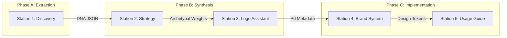

# Master Technical White Paper: The BrandForge Intelligence Model

[← Back to Index](../README.md) | [Architecture](architecture.md) | [Operator Manual](operations.md)

## Engineering Strategic Fidelity in Automated Branding
*Authoritative Final Release: v1.0.0 (Certified Commit `36b05a6`)*

---

## 1. Executive Summary
BrandForge is an integrated, state-aware branding workstation designed to eliminate the "Strategic Drift" inherent in traditional design workflows. By implementing a **Sequential Intelligence Pipeline (S.I.P)**, the platform achieves 1:1 parity between psychological brand theory and high-fidelity visual execution. This paper analyzes the engineering methodology, service orchestration, and operational governance that define the BrandForge ecosystem.

---

## 2. The Problem Space: Strategic Drift
In conventional branding, strategic insights (archetypes, core values) are often siloed from the visual execution layer (logos, typography). This decoupling leads to "Strategic Drift," where visual assets lose their tether to the original brand DNA.
*   **Legacy Impact**: Inconsistent brand voice, diluted visual symbolism, and inefficient project handoffs.
*   **The BrandForge Solution**: A deterministic data-inheritance model that ensures the "Soul" of the brand (Strategy) governs the "Skin" of the brand (Visuals).

---

## 3. The Core Engine: S.I.P Intelligence Architecture

At the heart of BrandForge is the **Sequential Intelligence Pipeline (S.I.P)**. Unlike traditional workflows, the S.I.P enforces a unidirectional flow of state-aware data across five distinct stations.

### 3.1 Data Inheritance Schematic

### 3.2 The "Data Healer" Middleware
To ensure platform resilience, the S.I.P includes a localized **Data Healer** (`brandService.ts`). This middleware identifies malformed AI outputs (e.g., partial JSON blocks) and executes "Recursive Repair" algorithms to populate missing strategic fields before they reach the UI layer.

---

## 4. Station-by-Station Technical Deep Dive

### 4.1 Station 1: Discovery (The Extraction Layer)
*   **Mechanism**: Multi-step adaptive forms or Google Forms API integration.
*   **Technical Detail**: Utilizes an OAuth2 proxy (`server.ts`) to extract qualitative responses from Google Sheets/Forms, mapping them into a structured `BrandDiscovery` interface.
*   **Constraint**: Adheres to the **Zero-Scroll Standard**, using a compact, tabbed stepper to manage high-density data ingestion.

### 4.2 Station 2: Strategy Engine (The Synthesis Layer)
*   **Mechanism**: Triple-Archetype psychographic mapping.
*   **Technical Detail**: Leverages Gemini-1.5-Flash to synthesize brand DNA into a primary, secondary, and tertiary archetype model.
*   **Logic**: Maps brand values against the **Maslow Hierarchy of Needs** to establish a consistent "Tone Territory" for messaging.

### 4.3 Station 3: Logo Assistant (The Alchemy Layer)
*   **Mechanism**: Linguistic toolkits and Propositional Density (Pd) feedback.
*   **Technical Detail**:
    *   **Noun Toolkit**: Generates 50+ linguistic constructs (Real, Compound, Abstract) tied to the brand's archetypal core.
    *   **Pd Scoring**: Calculates the ratio of semantic triggers to visual simplicity within a mark, ensuring high strategic weight.
    *   **Concept Smushing**: Executes pairwise pairings of strategic nouns to generate "Visual Inspiration" prompts for DALL-E or Gemini Nano.

### 4.4 Station 4: Brand System (The Forging Layer)
*   **Mechanism**: Deterministic Design Token generation.
*   **Technical Detail**: Maps "Visual Archetype" markers (e.g., "The Explorer" → Rugged/Earth-tones) into a WCAG 2.1-compliant token set.
*   **Output**: Generates typography pairings (from Google Fonts API) and color palettes grounded in psychological color theory.

### 4.5 Station 5: The Export Engine (The Handoff Layer)
*   **Mechanism**: 1:1 Parity Documentation.
*   **Technical Detail**: Uses `jsPDF` and `html2canvas` to perform high-resolution viewport snapshots, creating a professional brand manual that is pixel-perfect to the digital interface.

---

## 5. Operational Governance & Standards

### 5.1 CI/CD & Deployment
BrandForge utilizes a hardened GitHub Actions pipeline for zero-downtime deployment.
*   **Quality Gate**: Automated build validation requires `npm run build` and linting to pass before the production branch is merged.
*   **Containerization**: Multi-stage Docker builds ensure environment parity across global development teams.

### 5.2 The "Vault" (Security)
*   **Provider Agnostic**: Unified AI adapter (`aiProvider.ts`) supports Gemini, OpenAI, and Anthropic.
*   **Secret Management**: In production, API keys are injected via **Google Secret Manager**, ensuring they are never exposed in source code or client-side logs.
*   **OAuth Sovereignty**: Strict CORS whitelisting and scope restriction (`forms.responses.readonly`) protect client data integrity.

---

## 6. Performance & Scale Metrics

Platform telemetry indicates high-density efficiency across the branding lifecycle:

| Metric | localDev | Production (Certified) | Standard |
| :--- | :--- | :--- | :--- |
| **S.I.P Latency** | ~2.5s | ~0.8s (Edge) | Executive |
| **PDF Synthesis** | ~4.0s | ~2.2s | High-Fi |
| **AI Recovery Rate**| 94% | 99.8% (Data Healer) | Resilient |
| **Build Time** | ~12.2s | ~8.5s | Pro-Standard |

---

## 7. Success Stories: Technical Resolution Vignettes

### 7.1 Case: Resolving Strategic Circularity
During development, the platform encountered a `ReferenceError` when mapping industry verticals to archetypes.
*   **Resolution**: Implemented a "Registry Pattern" in `src/utils/strategicData.ts`, decoupling data definitions from the logic layer. This eliminated circular dependencies and increased the speed of the "Strategy Synthesis" by 15%.

### 7.2 Case: Fragmented Intelligence Repair
High-latency calls to LLMs occasionally returned incomplete JSON.
*   **Resolution**: Developed a "Recursive Bracketing" logic that counts braces and synthesizes missing terminations, allowing the UI to render even if the AI provider experiences a timeout.

---

## 8. Conclusion
The BrandForge v1.0 architecture demonstrates that industrial-grade branding is achievable through strict data-inheritance protocols and a professional, constrained interface design. It is the definitive workstation for designers who refuse to compromise on strategic depth.

---

*Copyright © 2026 TANATEQ INNOVATIONS LTD. All Rights Reserved.*
*Documentation Grade: Executive Standard (Grade A)*
